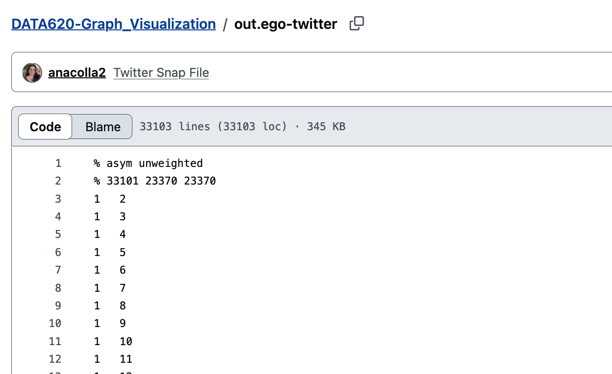
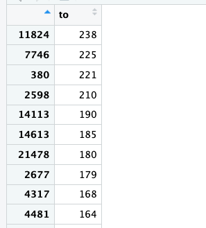

## Week 3- Graph Visualization

::: {.callout-note appearance="minimal" icon="false"}
This week's assignment is to:

Load a graph database of your choosing from a text file or other source. If you
take a large network dataset from the web (such as from Stanford Large Network
Dataset Collection), please feel free at this point to load just a small subset
of the nodes and edges.

Create basic analysis on the graph, including the graph’s diameter, and at least
one other metric of your choosing. You may either code the functions by hand (to
build your intuition and insight), or use functions in an existing package. Use
a visualization tool of your choice (Neo4j, Gephi, etc.) to display information.

Please record a short video (\~ 5 minutes), and submit a link to the video in
advance of our meet-up.You may work in a small group on this project. Parts one
and two should be posted to GitHub and submitted in your assignment link by end
of day Monday
:::

--------------------------------------------------------------------------------

```{python}
import networkx as nx
import matplotlib.pyplot as plt
import pandas as pd
import numpy as np
import random
import base64
```

### Data Load and Prep

The data I will be using is from SNAP, titled [Social Circles:
Twitter.](https://snap.stanford.edu/data/egonets-Twitter.html) I've created a
repository for the portion I will use for this assignment.

{fig-align="center"}

The data includes a readme file that explains what is found in the data. This
file is an adjacency matrix, with each row representing an edge. This data will
be simple enough to work with and explore.

I will load column 1 as "to" and column 2 as "from"

```{python}
twitter= pd.read_csv("https://raw.githubusercontent.com/anacolla2/DATA620-Graph_Visualization/refs/heads/main/out.ego-twitter", sep= "\t", comment= "%", header= None, names= ["from", "to"])
```

```{python}
twitter.head()
```

Now I'll create the graph. The raw data identified the data points "asymmetric"
and "unweighted". Its asymmetric the connections are listed in only one way. Its
unweuighted because there aren't multiple edges. The data shows if user A
follows user B, so there aren't multiples of the A $\rightarrow$ B connection.
So, `DiGraph` is my best option here.

```{python}
graph= nx.from_pandas_edgelist(twitter, source= "from", target= "to", create_using=nx.DiGraph())
```

I'll take a peak at the nodes and edges:

```{python}
print("Nodes/ Users", graph.number_of_nodes())
print("Edges/ Connections", graph.number_of_edges())
```

That's alot of nodes and edges. I will take a sample and go from there.

```{python}
random.seed(212)
sample1= random.sample(list(graph.nodes()), 300)

#--taking the samples selected from graph--
rd_sample= graph.subgraph(sample1).copy()

print("Nodes/ Users", rd_sample.number_of_nodes())
print("Edges/ Connections", rd_sample.number_of_edges())
```

The connections aren't worth plotting because there are only two edges. I think
it would be best if i dont take a random sample but instead graph the densest
connections\\

```{python}
twitter["from"].value_counts
```

```{python}
popular= pd.DataFrame(twitter.groupby("from")["to"].nunique().sort_values(ascending=False))
```

{fig-align="center"}

I'll focus on these users for my graph, instead of choosing at random. So I'll
pull a list.

```{python}
top_nodes= twitter.groupby("from")["to"].nunique().sort_values(ascending=False).head(10).index.to_list()
```

```{python}
best_nodes= graph.subgraph(top_nodes).copy()
print("Nodes/ Users", best_nodes.number_of_nodes())
print("Edges/ Connections", best_nodes.number_of_edges())
```

This doesn't work either. I'll try again and include their neighbors

```{python}
vecinos= set(top_nodes)

for node in top_nodes:
  vecinos.update(graph.neighbors(node))

graph2= graph.subgraph(vecinos).copy()

print("Nodes/ Users", graph2.number_of_nodes())
print("Edges/ Connections", graph2.number_of_edges())
```

Now this plot will be dense enough but focused to include those with most
connections.

```{python}
plt.figure(figsize= (10,10))
layout= nx.spring_layout(graph2)

nx.draw_networkx(graph2, pos=layout, node_color= "blue", edge_color="darkgray", arrows=True, with_labels=False, node_size= 9)

plt.title("Twitter Network- Top 10 Followed Users and their Many Neighbors")
plt.axis("off")
plt.show()
```

Well the graph is certainly dense! To add a little bit more clarity I'll set an
alpha on the edges, and I'll remove the directions.

```{python}
plt.figure(figsize= (12,12), dpi=600)

nx.draw_networkx(graph2, pos=layout, node_color= "skyblue", edge_color="gray", arrows=False, with_labels=False, node_size= 9, alpha=0.4)

plt.title("Twitter Network- Top 10 Followed Users and their Many Neighbors")
plt.axis("off")
plt.show()
```

There are many overlapping edges. I do like that the graph requires no labels
because the users are anonymous and no classifying information is included so,
in this case, it serves us better as an overview of the clusters in the twitter
user network.

```{python}
#| echo: false
#| 
from IPython.display import HTML

with open("node_clusters.GIF", "rb") as f:
  data= base64.b64encode(f.read()).decode("utf-8")

HTML(f'')
```

There are 9 node clusters in the graph. We don't have information on the actual
users documented as I mentioned, but it would be interesting to see what kind of
topics are associated with each user and in a macro sence, each node cluster.

There are also what I would call user bridges. The users that connect one node
cluster to another.

```{python}
#| echo: false
from IPython.display import HTML

with open("user_bridges.GIF", "rb") as f:
  data= base64.b64encode(f.read()).decode("utf-8")

HTML(f'')
```

Now that I've explored the graph and manipulated it a little bit, to conclude
the assignment with the couple of mentrics of the graph.

```{python}
#--degrees for all nodes--
degrees= [len(list(graph2.neighbors(n))) for n in graph2.nodes()]

#--visualizing this--
plt.figure()
plt.hist(degrees, color="skyblue", edgecolor="white")
plt.show()

#--logging it so its more evenly distributed--
plt.figure()
plt.hist(degrees, color="skyblue", edgecolor="white")
plt.yscale("log")
plt.title("Logged Distribution of Node Degrees in Twitter Data")
plt.show()
```

The logged distribution of degrees shows most nodes don't have many neighbors.
However there a few users that have many neighbors.

```{python}
diameter= nx.diameter(graph2.to_undirected())
print("Diameter:", diameter)
```

The diameter calculated is 7. So to get from one User to the other there are 7
follows or less in between. I'm not sure how to conceptualize that. I don't use
twitter but I'd assume users follow many people to keep their feeds fresh. It
seems 7 is not much considering.
